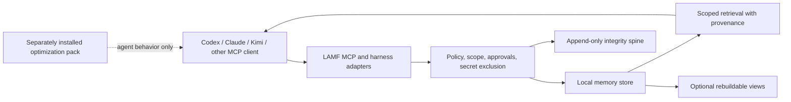

# Architecture

LAMF is one local authority exposed to compatible agents through MCP or harness adapters. Writes are sanitized and policy-checked before revisioned records are projected into the local store and append-only integrity spine. Retrieval is scope-filtered and returns provenance metadata. Optional views and integrations are downstream of the authority.

The optimization pack is not in the write, storage, or retrieval authority path. Disabling or removing it does not delete or migrate memory.
