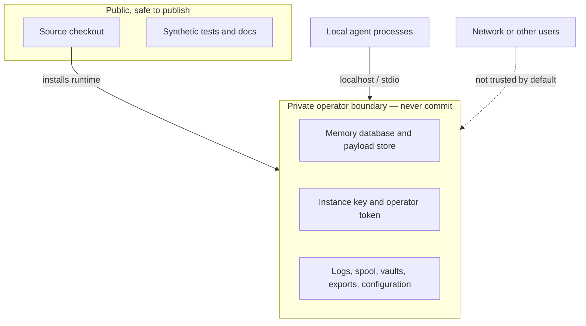

# Threat boundaries

LAMF reduces accidental cross-agent fragmentation and applies local policy controls; it does not make an untrusted or compromised host safe.

Assumptions: the operator controls the machine and filesystem permissions; localhost is not exposed; dependencies and downloaded releases are verified; and sensitive backups are protected. Out of scope: a compromised OS or administrator, malicious agent with equivalent local access, physical extraction from an unlocked machine, and safety of third-party harnesses. Before reporting a bug, replace all live state with synthetic data.
